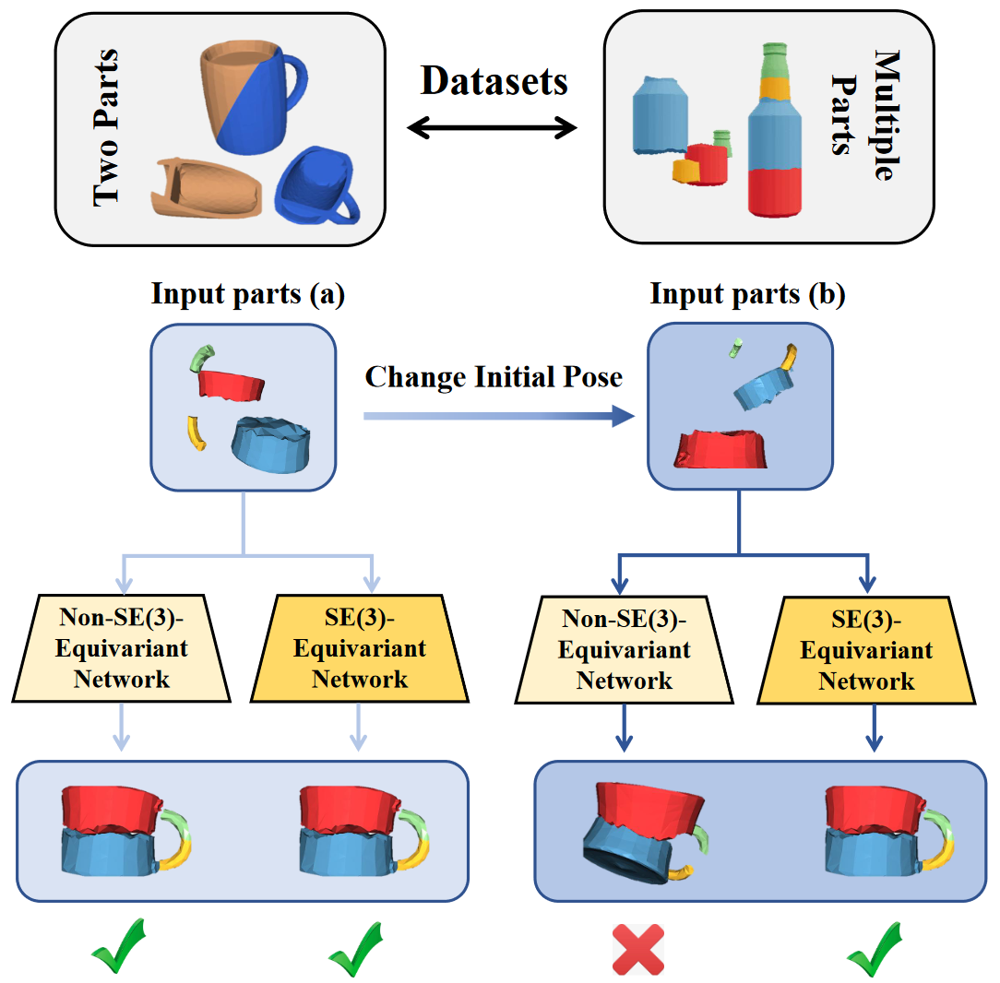

### This is the official implementation of the paper [Leveraging SE(3)-Equivariance for Learning 3D Geometric Shape Assembly](https://crtie.github.io/SE-3-part-assembly/) (ICCV 2023)

[Project](https://crtie.github.io/SE-3-part-assembly/) | [Paper](https://openaccess.thecvf.com/content/ICCV2023/html/Wu_Leveraging_SE3_Equivariance_for_Learning_3D_Geometric_Shape_Assembly_ICCV_2023_paper.html) | [Video](https://youtu.be/pEtIAal-xgQ)




## Environment Installation

Our environment dependencies are included in the "BreakingBad\multi_part_assembly.egg-info\requires.txt" file. You can easily install them when you create a new conda environment.


## Dataset Generation

For **Breaking Bad** dataset, please download the dataset following https://breaking-bad-dataset.github.io/.

For **Geometric Shape Mating** dataset, please generate the dataset following https://github.com/pairlab/NSM.
Besides, you can download the dataset we generate in https://www.dropbox.com/scl/fi/xigal4s4xmksie4ihm7su/ShapeNet_0103.zip?rlkey=54f9w1fcnc2fjm5xmijpmkzf5&dl=0.


## Train Models

To train models for **Breaking Bad** dataset, pleas run
```
cd BreakingBad
python scripts/train.py --cfg_file configs/vnn/vnn-everyday.py
```

To train models for **Geometric Shape Mating** dataset, pleas run
```
cd GSM
python script/train_eqv_CR.py --cfg_file train_vnn_pn.yml
```


## Evaluate Models
To evaluate models for **Geometric Shape Mating** dataset, pleas run
```
cd GSM
python script/eval_eqv_CR.py --cfg_file eval_vnn_pn.yml
```

## Citation
If you find this paper useful, please consider citing:
```
@InProceedings{Wu_2023_ICCV,
    author    = {Wu, Ruihai and Tie, Chenrui and Du, Yushi and Zhao, Yan and Dong, Hao},
    title     = {Leveraging SE(3) Equivariance for Learning 3D Geometric Shape Assembly},
    booktitle = {Proceedings of the IEEE/CVF International Conference on Computer Vision (ICCV)},
    month     = {October},
    year      = {2023},
    pages     = {14311-14320}
}
```

## Contact
If you have any questions, please feel free to contact [Ruihai Wu](https://warshallrho.github.io/) at wuruihai_at_pku_edu_cn and [Chenrui Tie](https://crtie.github.io/) at crtie_at_pku_edu_cn
